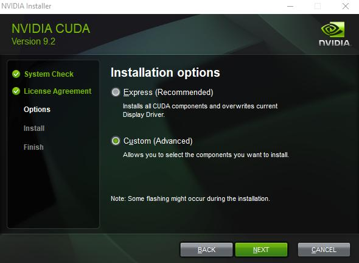
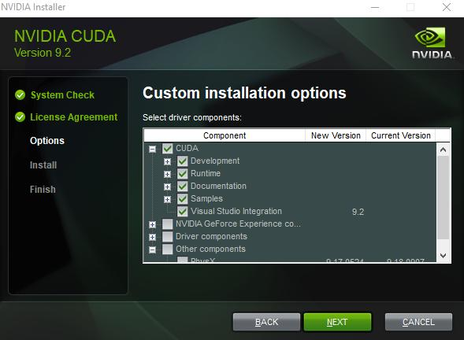
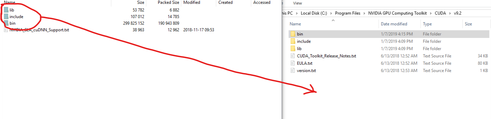
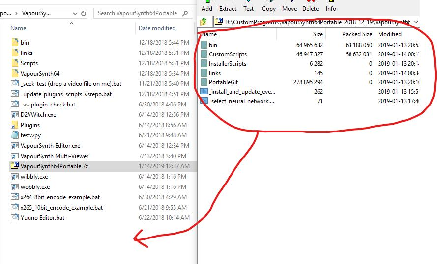

# vs_mxnet_helper
Some simple scripts that ease the setup and configuration of MXNet image processing in VapourSynth.

Installation Instructions:

This guide will show you how to get a wide range of neural networks upscalers running on videos and images. It’s only been tested on Windows 10 so far, but might work if you have Windows 7. Linux users will have to install the dependencies themself, for now. If you have an AMD or Intel GPU, you can skip most of this guide and just run the Universal Benchmark. Make sure to have 7zip or a similar archive manager installed beforehand. 

First, download the latest version of the Vapoursynth FATPACK from here: 

https://forum.doom9.org/showthread.php?t=175529

Uzip it somewhere you have at least 10GB of free space.

Download Nvidia CUDA 9.2 From Here:

https://developer.nvidia.com/cuda-92-download-archive?target_os=Windows&target_arch=x86_64

Do a custom install, and ONLY install everything under the “CUDA” checkbox, so it won’t try to overwrite your current drivers, as seen below:

Next, give Nvidia an email address and download cuDNN for CUDA 9.2 from the link below. Don't get the version for 10.0, or any of the older CUDA versions, only 9.2. I cannot legally redistribute this file, you have to download it yourself: 

https://developer.nvidia.com/rdp/form/cudnn-download-survey

Next, open or unzip the cuDNN archive. Drag the 3 folders in the archive’s “cuda” folder to the “v9.2” folder in your Nvidia CUDA install location. By default, it’s at “%programfiles%\NVIDIA GPU Computing Toolkit\CUDA\v9.2” for me, but it might be in the hidden %programdata% folder instead. 

Or, alternatively, you can follow Nvidia’s instructions here, which tell you to do the same thing:

https://docs.nvidia.com/deeplearning/sdk/cudnn-install/index.html#installwindows

Now, drag all the files from the “VapourSynth64Portable” folder in the download below to the “VapourSynth64Portable” folder you unzipped from the VapourSynth fatpack. 

https://drive.google.com/open?id=1RcWJgQfv63QcaPYVXgoIZu2vPk3JPfNT

This is where the automation starts taking over. Double click "_install_and_update_everything.bat"

Let it run, it'll take awhile to download everything. If you get any errors during the MXNet install, that probably means you didn't install CUDA or cuDNN correctly, or that you don't have a Nvidia GPU. Don't worry about the "chardetect.exe" warning. You can run this /bat file again at any time to update everything, or try failed installations again. 

Optionally, you can run "select_neural_network.bat" at any time, as long as the scripts aren't open in an editor. Every .vpy script that ends in "Auto" will automatically be updated. MSRN is selected by default, but you can choose from any of the scripts in WolframRhodium's Super Resolution Zoo repo, and it'll automatically change the algorithm in the processing scripts. If you're interested in learning more about each algorithm, you can look through the "NeuralNetworks" folder, or poke through the repo here:

https://github.com/WolframRhodium/Super-Resolution-Zoo

To actually process images/video, click the "VapourSynth Editor.exe" shortcut. Some premade scripts are in the "CustomScripts" folder. If you want to just benchmark your GPU, open "NvidiaBenchmarkAuto.vpy," or "UniversalBenchmark.cpy" if you're on an AMD GPU or an IGP. Under the "Script" tab of VapourSynth Editor, hit "check script" to make sure everything works. You can preview the test video that's getting upscaled with "preview", or you can click "benchmark" to go straight to the test. 

If you want to actually process images or video, open "ExampleAuto.vpy". To preview the processing, click "Preview" in the "Script" tab. Use the seek bar to seek to a part of the video you want to see, and then use the left and right arrow keys to switch between the original frame and the processed one. You can remove the "#" in front of lines to enable or disable different filters and try thier effects. Vapoursynth Editor has a tab that can encode videos using the script. The vapoursynth fatpack has some .bat file command line encoding examples, and I've provided one that Nvidia GPU encoding. 

Known Issues:

-ProSR isn't being parsed by "select_neural_network.bat" correctly, fix coming soon. 

TODO:

 -Write more in the readme, and the todo list. Format the readme.
 
 -Give more credit where credit is due.
 
 -Add OpenCV upscalers that might work on AMD cards. See https://github.com/WolframRhodium/muvsfunc/tree/master/Collections/examples
 
 -Replace some tutorial images with .gifs
 
 -Add more images
 
 -Add better NVENC arguments for ffmpeg
 
 -Add more example scripts and encoding options
 
 -Investigate the Intel MKL version of MxNet: https://software.intel.com/en-us/mkl https://pypi.org/project/mxnet-mkl/
 
 
